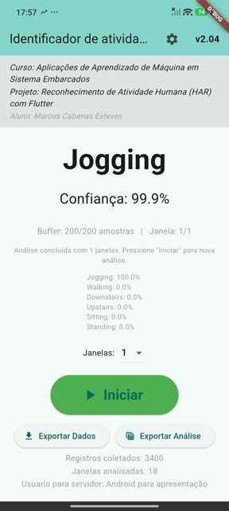
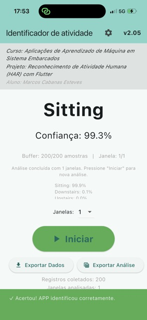

# HAR App - Reconhecimento de Atividade Humana

Projeto final da disciplina Aplicações de Aprendizado de Máquina em Sistemas Embarcados.

Autor: Marcos Cabanas Esteves

## Sobre o projeto

Este aplicativo coleta dados do acelerômetro do celular a 20 Hz, agrupa as amostras em janelas de 200 leituras (10 s) e usa um modelo TensorFlow Lite para classificar atividade humana em tempo real.

Classes previstas:

- Walking
- Jogging
- Standing
- Sitting
- Upstairs
- Downstairs

## Compatibilidade mínima

- Android 5.0 (Lollipop, API 21) ou superior.
- iOS 11.0 ou superior.

## Apresentação do APP

Este app foi desenvolvido para demonstrar, de forma prática, a aplicação de IA embarcada em smartphone. Na apresentação, eu mostro a coleta em tempo real pelo acelerômetro, a classificação da atividade com TensorFlow Lite no próprio dispositivo e a exportação dos resultados para análise e validação.

## Imagens do APP

	
	

## Estrutura do repositório

- APP/har_app: app Flutter (Android/iOS) com inferência local.
- backend: API para receber coletas e apoiar aferição.
- WISDM_para_Android_V3.ipynb: notebook principal de preparo, treino e avaliação.
- avaliacao_tflite_har.ipynb: notebook complementar de avaliação.
- model.tflite: modelo exportado para uso no app.

## Como instalar no celular

### Android (.apk)

Escolha do APK (qual baixar):

- `app-arm64-v8a-release.apk` (recomendado): maioria dos celulares Android atuais.
- `app-armeabi-v7a-release.apk`: aparelhos Android mais antigos (32 bits).
- `app-x86_64-release.apk`: emuladores Android no computador e poucos dispositivos específicos.

Links diretos para os APKs deste repositório:

- [Baixar APK arm64-v8a (recomendado)](APP/har_app/build/app/outputs/flutter-apk/app-arm64-v8a-release.apk)
- [Baixar APK armeabi-v7a (Android antigo)](APP/har_app/build/app/outputs/flutter-apk/app-armeabi-v7a-release.apk)
- [Baixar APK x86_64 (emulador/desktop)](APP/har_app/build/app/outputs/flutter-apk/app-x86_64-release.apk)

